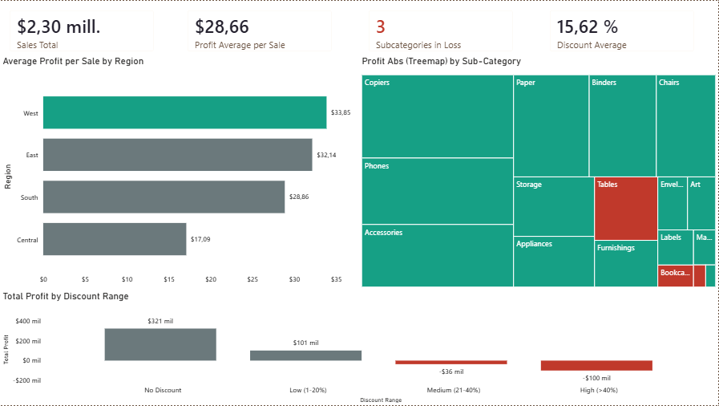

# Retail Sales Analysis

## Overview
Analysis of 9,994 retail transactions (Sample Superstore dataset) to identify 
profitability patterns by region, product category, and discount strategy. 
Built with SQL for exploratory analysis and Power BI for interactive visualization.

## Stack
- SQLite (data storage & querying)
- SQL (aggregation, JOIN, subqueries, CASE WHEN)
- Power BI Desktop (data modeling, DAX measures, dashboard)

## Key Findings

**1. Profitability by Region**
West region leads in average profit per sale (~$33.85), while Central lags 
significantly (~$17.09) despite comparable transaction volume.

**2. Category/Sub-Category Performance**
3 sub-categories operate at a loss on average: Tables, Bookcases, and Supplies. 
Tables shows the steepest negative margin, visible in the treemap.

**3. Discount Impact**
Clear inverse relationship between discount rate and profit: transactions with 
no discount generated $321K in total profit, while discounts above 40% resulted 
in a $100K loss.

## Dashboard

## How to Reproduce
1. Clone this repo
2. Load `data/SampleSuperstore.csv` into SQLite using `tablas.sql`
3. Run queries in `consultas.sql` to verify the SQL findings
4. Open `powerbi/ventas-retail.pbix` in Power BI Desktop to explore the dashboard
